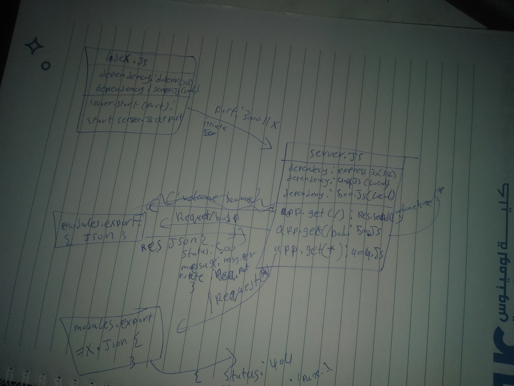

# LAB - 01(server-deployment-practice)

## Deployment Test

### Author: Mohammad Quthama

- [submission PR](https://github.com/tutuorial-401js/class-00)
- [tests report](https://github.com/tutuorial-401js/class-00/actions)
- [dev-deployment](https://mohammad-server-deploy-dev.herokuapp.com)
- [master-deployment](https://mohammad-server-deploy-dev.herokuapp.com)

### Setup

#### `.env` requirements

- `PORT` - 3000

#### Running the app

- `npm start`

- Endpoint: `/`
  - Returns text

```JavaScript

   res.send('Welcome Home')

```

#### Tests

- Unit Tests: `npm run test`

#### UML


